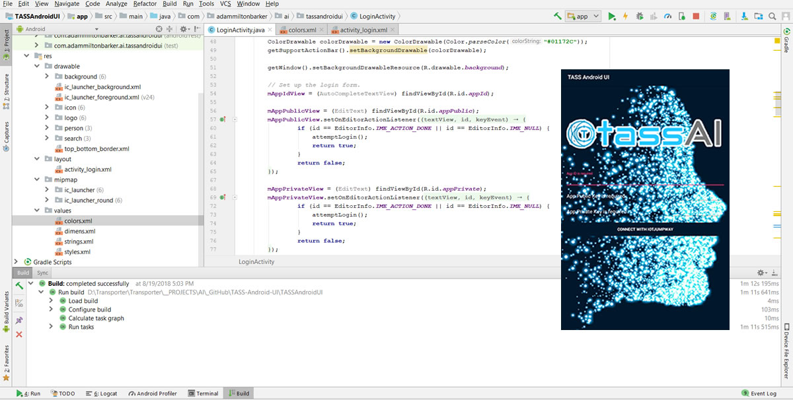

# TASS Android UI
**THIS TUTORIAL IS NOT YET COMPLETE**

TASS Android UI is an open source Android application for using a remote TASS Classifier to classify people and intruders in real time.

# What Will We Do?

The following steps provide the scope of this tutorial:

- Create an iotJumpWay application
- Clone the TASS Android UI project
- Run the UI application on an Android device

# Prequisites

- Complete the [TASS-Facenet](https://github.com/TASS-AI/TASS-Facenet "TASS-Facenet") tutorial and start the API server.

# Software Requirements

- Android Studio

# Create iotJumpWay Application

First you should create an **iotJumpWay** application that will provide the login credentials for your Android application. If you have never created an iotJumpWay application you can view the simple process in the [iotJumpWay Application Getting Started tutorial](https://www.iotjumpway.tech/developers/getting-started-applications "iotJumpWay Application Getting Started tutorial"). Keep a note of the credentials provided as you will need them further into the tutorial, specifically you will need the **Application ID**, **MQTT Username** & **MQTT Password**.

# Clone The TASS Android UI Project

You will need to clone this repository to a location on your development terminal. Navigate to the directory you would like to download it to and issue the following commands.

    $ git clone https://github.com/TASS-AI/TASS-Android-UI.git

Once you have the repo, you will need to find the files in this folder located in [TASS-Android-UI](https://github.com/TASS-AI/TASS-Android-UI "TASS-Android-UI").

Once the application has opened up, you can enter your credentials into the login form and submit to the iotJumpWay **TASS API**, although this is the current scope of the tutorial, this README will be updated with progress as and when.

# Start Android Application

Plug your Android device into your development computer and allow the permissions requested, then run the application. Once you meet the login page enter your iotJumpWay app credentials.

# Versioning
We use SemVer for versioning. For the versions available, see the tags on this repository. You can keep up to date with release information in the [RELEASES](https://github.com/TASS-AI/TASS-Android-UI/blob/master/RELEASES.md "RELEASES") document.

# Bugs/Issues 

We use the repository [Issues](https://github.com/TASS-AI/TASS-Android-UI/issues "Issues") area to track bugs and general requests related to using this project. This allows management of issues in the project public and private Github Projects.

# Contributing
Please read [CONTRIBUTING](https://github.com/TASS-AI/TASS-Android-UI/blob/master/CONTRIBUTING.md "CONTRIBUTING") document for details on the code of conduct for this project, and the process for submitting pull requests.

# License
This project is licensed under the **MIT License** - see the [LICENSE](https://github.com/TASS-AI/TASS-Android-UI/blob/master/LICENSE.md "LICENSE") document for details.

# Author

 
