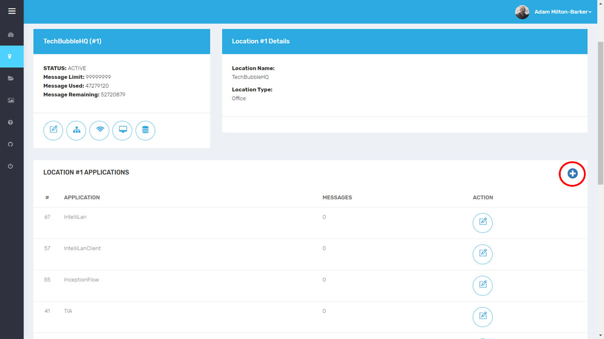

# TASS Android UI

TASS Android UI is an open source Android application for using a remote TASS Classifier to classify people and intruders in real time.

What Will We Do?

- Create an iotJumpWay application

# Create iotJumpWay Application

First you should create an iotJumpWay application that will provide the login credentials for your Android application. If you have never created an iotJumpWay application you can view the simple process in the [iotJumpWay Application Getting Started tutorial](https://www.iotjumpway.tech/developers/getting-started-applications "iotJumpWay Application Getting Started tutorial"). Keep a note of the credentials provided as you will need them further into the tutorial.

# Contributing
Please read **CONTRIBUTING.md** for details on our code of conduct, and the process for submitting pull requests to us.

# Versioning
We use SemVer for versioning. For the versions available, see the tags on this repository.

# License
This project is licensed under the **MIT License** - see the **LICENSE.md** file for details

# Bugs/Issues

We use issues to track bugs and general requests related to using this project.

# Author

 
